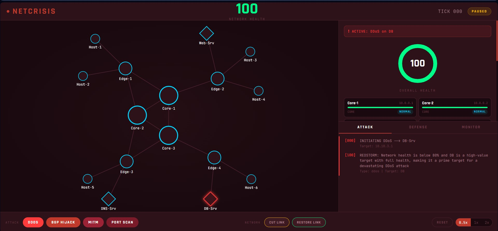
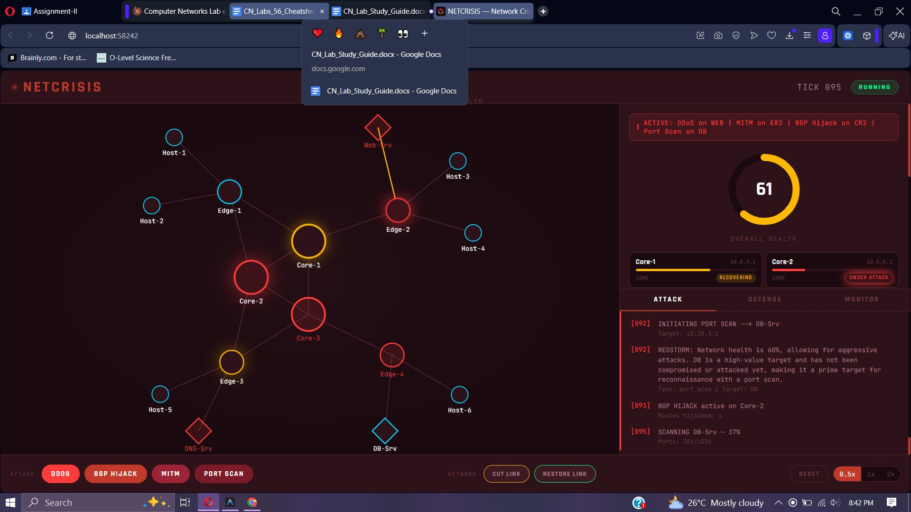

# NETCRISIS — Network Crisis Simulation Dashboard

A real-time, AI-powered network crisis simulation platform featuring a cinematic dark-themed dashboard with D3.js topology visualization, four autonomous LLM agents (attacker, defender, monitor, traffic), and a full NetworkX-based simulation engine.


---



---



---

## Overview

NETCRISIS simulates a realistic enterprise network under cyber attack. Four AI agents powered by Groq's LLaMA 3.3 70B autonomously attack, defend, monitor, and generate traffic across a 16-node network topology. The frontend renders everything in real-time through WebSocket streaming.

### Key Features

- **16-Node Network Topology** — 3 core routers, 4 edge routers, 6 hosts, 3 servers (DNS, Web, DB)
- **OSPF Routing** — Dijkstra shortest-path routing with dynamic link costs
- **BGP Route Tables** — Routing information base for all core/edge routers
- **ACL Engine** — Per-node access control lists for traffic filtering
- **4 AI Agents** — LangChain chains with distinct personas via Groq LLaMA 3.3 70B
- **LangGraph Orchestration** — StateGraph controlling agent execution every 4 ticks
- **D3.js Force-Directed Graph** — Interactive topology with drag, hover tooltips, packet animation
- **Real-Time WebSocket** — Sub-second state streaming from backend to frontend
- **Attack Simulation** — DDoS, BGP Hijack, MITM, Port Scan with progressive impact
- **Auto-Defense** — Rate limiting, node isolation, ACL updates, emergency patching

---

## Architecture

```
┌─────────────────────────────────────────────────────────┐
│                    FRONTEND (Vanilla JS)                │
│  ┌──────────┐ ┌──────────┐ ┌────────┐ ┌──────────────┐  │
│  │ D3.js    │ │ Health   │ │ Logs   │ │ Control      │  │
│  │ Topology │ │ Dashboard│ │ Panel  │ │ Panel        │  │
│  └────┬─────┘ └────┬─────┘ └───┬────┘ └──────┬───────┘  │
│       │             │           │              │        │
│       └─────────────┴───────┬───┴──────────────┘        │
│                        EventBus                         │
│                          │  ▲                           │
│                     WS ▼  │ REST                        │
└─────────────────────────────────────────────────────────┘
                          │
                    WebSocket /ws
                    REST /control/*
                          │
┌─────────────────────────────────────────────────────────┐
│                  BACKEND (Python FastAPI)               │
│                                                         │
│  ┌──────────────────────────────────────────────────┐   │
│  │              main.py (FastAPI)                    │  │
│  │  WebSocket broadcast │ REST endpoints │ Tick loop │  │
│  └──────────┬───────────┴────────────────────────────┘  │
│             │                                           │
│  ┌──────────▼──────────┐    ┌────────────────────────┐  │
│  │   simulation.py     │    │      graph.py          │  │
│  │   NetworkX Engine   │◄───│   LangGraph StateGraph │  │
│  │   OSPF / BGP / ACL  │    │   Agent Orchestration  │  │
│  └─────────────────────┘    └───────────┬────────────┘  │
│                                         │               │
│                              ┌──────────▼──────────┐    │
│                              │     agents.py        │   │
│                              │  4 LangChain Chains  │   │
│                              │  Groq LLaMA 3.3 70B  │   │
│                              └──────────────────────┘   │
└─────────────────────────────────────────────────────────┘
```

---

## Project Structure

```
CN/
├── index.html                  # Main HTML page
├── favicon.svg                 # Network-themed favicon
├── css/
│   ├── variables.css           # Design tokens (colors, fonts, spacing)
│   ├── base.css                # Reset, layout, animations, scrollbar
│   ├── topbar.css              # Top bar (logo, health score, tick)
│   ├── topology.css            # D3 graph (nodes, links, tooltips)
│   ├── dashboard.css           # Health donut, node cards, banners
│   ├── logs.css                # Tabbed log panel
│   └── controls.css            # Bottom control bar, buttons, dialogs
├── js/
│   ├── app.js                  # WebSocket client + state dispatcher
│   ├── network.js              # EventBus utility
│   ├── topology.js             # D3.js force-directed graph renderer
│   ├── dashboard.js            # Health donut + node status cards
│   ├── logs.js                 # Tabbed log panel (attack/defense/monitor)
│   ├── controls.js             # Button handlers → REST API calls
│   ├── simulation.js           # (emptied — runs on backend)
│   └── attacks.js              # (emptied — runs on backend)
├── backend/
│   ├── main.py                 # FastAPI app: WebSocket + REST + tick loop
│   ├── simulation.py           # NetworkX topology engine
│   ├── agents.py               # 4 LangChain agent chains (Groq)
│   ├── graph.py                # LangGraph StateGraph orchestrator
│   ├── requirements.txt        # Python dependencies
│   ├── .env.example            # Environment variable template
│   └── .env                    # Your API key (create from .env.example)
└── README.md
```

---

## Quick Start

### Prerequisites

- Python 3.10+
- Node.js (for `npx serve` — or any static HTTP server)
- Groq API key (free at https://console.groq.com/keys)

### 1. Setup Backend

```bash
cd backend
pip install -r requirements.txt
copy .env.example .env
# Edit .env and add your GROQ_API_KEY
python main.py
```

Backend starts at `http://localhost:8000`.

### 2. Serve Frontend

```bash
cd ..   # back to CN root
npx -y serve .
```

Frontend serves at `http://localhost:3000`.

### 3. Open Dashboard

Navigate to **http://localhost:3000** — it auto-connects to the backend WebSocket.

> **No Groq key?** The system falls back to rule-based agent logic automatically.

---

## AI Agents

| Agent | Codename | Role | Behavior |
|-------|----------|------|----------|
| Attacker | **REDSTORM** | Launches cyber attacks | Targets high-value nodes, varies attack types, escalates when defenses are weak |
| Defender | **GUARDIAN** | Mitigates threats | Rate-limits DDoS, isolates compromised nodes, patches critical systems |
| Monitor | **OVERWATCH** | Observes and alerts | Detects anomalies, reports severity levels, tracks network health trends |
| Traffic | **FLOWMASTER** | Generates user traffic | Simulates realistic HTTP/DNS/DB flows, adapts to outages |

Agents run every **4 ticks** via LangGraph's StateGraph. Each agent receives a condensed network summary and returns structured JSON decisions that are applied to the simulation.

---

## API Endpoints

| Method | Endpoint | Description |
|--------|----------|-------------|
| `WS` | `/ws` | WebSocket — streams tick state every second |
| `GET` | `/health` | Current health, tick, state, counts |
| `POST` | `/control/attack` | Launch attack `{type, target}` |
| `POST` | `/control/cut-link` | Sever link `{source, target}` |
| `POST` | `/control/restore-link` | Restore link `{source, target}` |
| `POST` | `/control/reset` | Reset entire simulation |
| `POST` | `/control/start` | Start simulation |
| `POST` | `/control/pause` | Pause simulation |
| `POST` | `/control/speed?speed=2` | Set speed (0.5x, 1x, 2x) |

---

## Controls

| Action | How |
|--------|-----|
| Play / Pause | Press **SPACE** |
| Launch Attack | Click attack button → select target from dropdown |
| Cut Link | Click **CUT LINK** → click two nodes on graph |
| Restore Link | Click **RESTORE LINK** → click two nodes on graph |
| Change Speed | Click **0.5x / 1x / 2x** toggle |
| Reset | Click **RESET** → confirm dialog |

---

## Tech Stack

**Frontend:** HTML5, CSS3, Vanilla JavaScript, D3.js v7, Google Fonts (Rajdhani, JetBrains Mono, Inter)

**Backend:** Python 3.10+, FastAPI, NetworkX, LangChain, LangGraph, Groq (LLaMA 3.3 70B), Uvicorn

---
